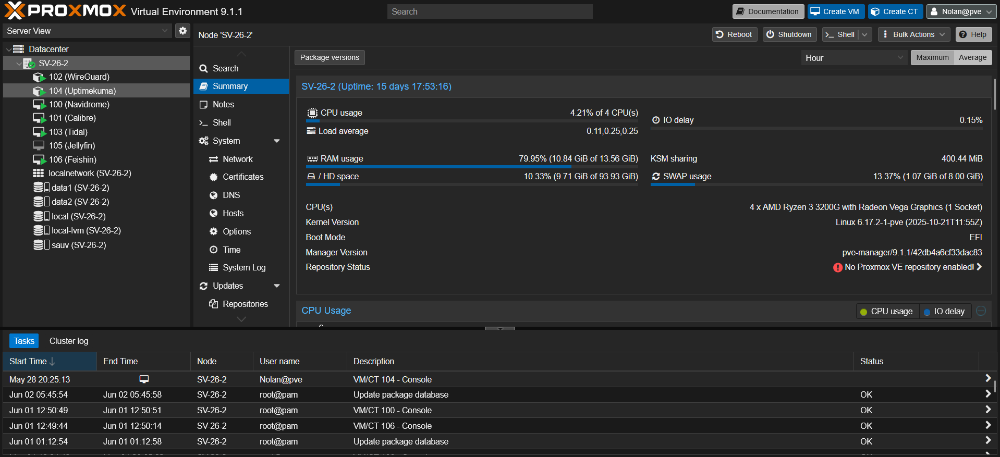
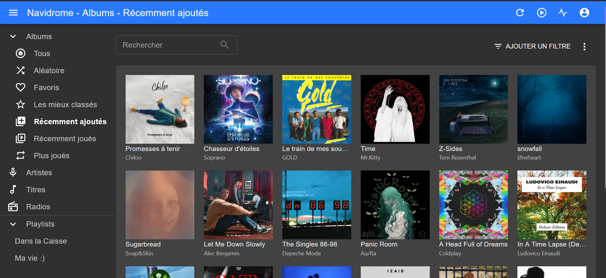
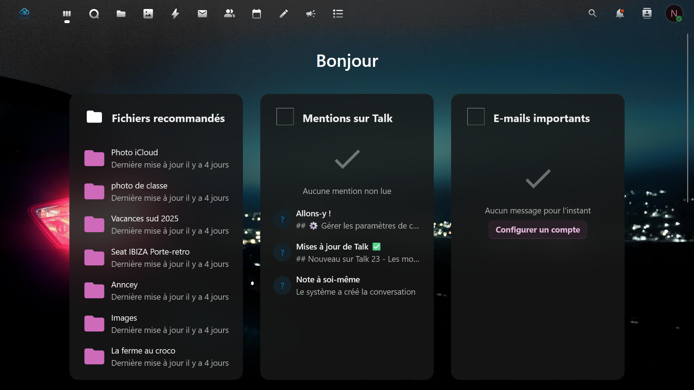
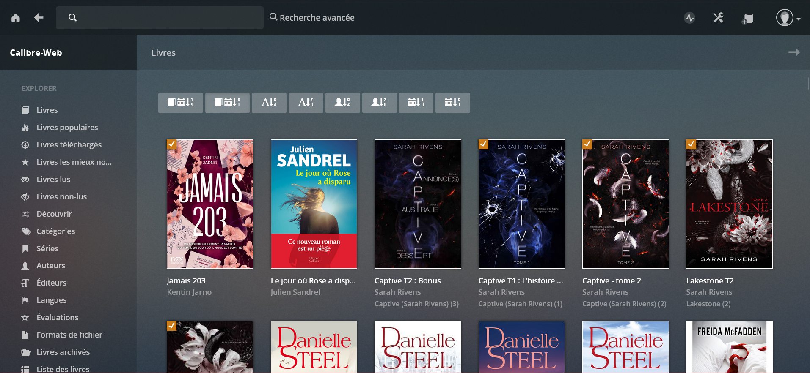

# Projet-serveur-multimedia-et-collaboratif-CIEL
# 🎬 Projet Serveur Multimédia et Collaboratif

## 🛠️ Documentation

- 📖 [Présentation du projet](README.md)
- 🛠️ [Partie Technique](Technique.md)

# Explication 

## 📖 Présentation

Ce projet a pour objectif de mettre en place une plateforme numérique permettant de centraliser différents services utiles au quotidien.

L'objectif est de proposer un espace unique permettant d'accéder à ses médias, ses documents et ses livres numériques tout en facilitant le partage et la collaboration entre utilisateurs.

---

## 🚀 Services proposés

### 🎥 Jellyfin
Serveur multimédia permettant de regarder des films, séries et vidéos depuis n'importe quel appareil connecté.

### 🎵 Navidrome
Plateforme de streaming musical personnelle permettant d'écouter sa bibliothèque musicale en ligne.

### ☁️ Nextcloud
Espace de stockage et de partage de fichiers accessible à distance.

### 📚 Calibre-Web
Gestionnaire de bibliothèque numérique permettant de consulter et télécharger des livres électroniques.

### 📝 OnlyOffice
Suite bureautique en ligne permettant la création et la modification collaborative de documents.

### 📊 Uptime Kuma
Outil de supervision permettant de vérifier la disponibilité des différents services.

---

## 🎯 Objectifs du projet

- Centraliser plusieurs services sur une même infrastructure
- Faciliter l'accès aux contenus numériques
- Permettre le partage sécurisé des fichiers
- Favoriser le travail collaboratif
- Découvrir les technologies d'auto-hébergement

---

## 🔒 Sécurité

Plusieurs mesures sont mises en place afin de protéger l'accès aux services :

- Authentification des utilisateurs
- Accès sécurisé via HTTPS
- Reverse proxy (Pangolin 0 trust)
- Gestion des droits d'accès
- Sauvegarde des données importantes

---

## 📸 Captures d'écran

### 🏠 Proxmox


### 🎵 Navidrome


### ☁️ Nextcloud


### 📚 Calibre-Web


---

## 🛠️ Technologies utilisées

- 🖥️ Proxmox
- 🐳 Docker
- ☁️ Nextcloud
- 🎥 Jellyfin
- 🎵 Navidrome
- 📚 Calibre-Web
- 📝 OnlyOffice
- 📊 Uptime Kuma
- 🌐 Pangolin

---

## 🛠️ Partie Technique

### 🖥️ Préparation de l'infrastructure pour toutes les VMs

#### Installation de Docker

```bash

apt update && apt upgrade -y

apt install -y ca-certificates curl

install -m 0755 -d /etc/apt/keyrings

curl -fsSL https://download.docker.com/linux/debian/gpg -o /etc/apt/keyrings/docker.asc

chmod a+r /etc/apt/keyrings/docker.asc

echo \
  "deb [arch=$(dpkg --print-architecture) signed-by=/etc/apt/keyrings/docker.asc] \
  https://download.docker.com/linux/debian \
  $(. /etc/os-release && echo "$VERSION_CODENAME") stable" | \
  tee /etc/apt/sources.list.d/docker.list > /dev/null

apt update

apt install -y docker-ce docker-ce-cli containerd.io docker-buildx-plugin docker-compose-plugin

```

#### Création du dossier du projet ou sera Navidrome 

```bash
mkdir -p /opt/navidrome 
cd /opt/navidrome
```

#### Création du dossier du projet ou sera Calibre

```bash
mkdir -p /opt/Calibre 
cd /opt/Calibre
```

#### Création du dossier du projet ou sera Jellyfin

```bash
mkdir -p /opt/Jellyfin 
cd /opt/Jellyfin
```

#### Création du dossier du projet ou sera Nextcloud

```bash
mkdir -p /opt/Nextcloud 
cd /opt/Nextcloud
```

#### Création du dossier du projet ou sera OnlyOffice 

```bash
mkdir -p /opt/OnlyOffice 
cd /opt/OnlyOffice
```


## 👨‍💻 Auteur

Projet réalisé dans le cadre de ma formation en **Bac Professionnel CIEL** by nnonno_917 / ibv_781 / Roi Du Feu.

