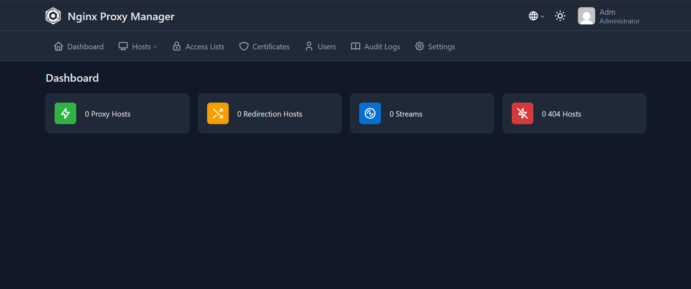

# 🎬 Projet Serveur Multimédia et Collaboratif

## 🛠️ Documentation

- 🛠️ [Partie Technique](Technique.md)

# Explication 

## 📖 Présentation

Ce projet a pour objectif de mettre en place des services numérique permettant de centraliser différents services utiles au quotidien.

Le but est de proposer un espace unique permettant d'accéder à ses médias, ses documents et ses livres numériques tout en facilitant le partage et la collaboration entre utilisateurs.

---

## 🚀 Services proposés

### 🎥 Jellyfin
Serveur multimédia permettant de regarder des films, séries et vidéos depuis n'importe quel appareil connecté.

### ☁️ Nextcloud
Espace de stockage et de partage de fichiers accessible à distance.

### 📚 Calibre-Web
Gestionnaire de bibliothèque numérique permettant de consulter et télécharger des livres électroniques.

### 📝 OnlyOffice
Suite bureautique en ligne permettant la création et la modification collaborative de documents.

### 📊 Uptime Kuma
Outil de supervision permettant de vérifier la disponibilité des différents services.

---

## 🎯 Objectifs du projet

- Centraliser les données sur un serveur unique.
- Permettre l’accès distant aux fichiers et services.
- Faciliter le partage et la collaboration.
- Héberger des contenus multimédias et des documents.
- Sécuriser les données et les accès.
- Assurer la supervision du système et des services.
- Développer des compétences en administration système et réseau.
- Concevoir une infrastructure évolutive et autonome.

---

## 🔒 Sécurité

Plusieurs mesures sont mises en place afin de protéger l'accès aux services :

- Authentification des utilisateurs.
- Accès sécurisé via HTTPS.
- Reverse proxy (Nginix Proxy Manager).
- Gestion des droits d'accès.
- Sauvegarde des données.

---

## 📸 Captures d'écran

### 🏠 Proxmox

### ☁️ Nextcloud

### 📚 Calibre-Web

### 📈 UptimeKuma

### 🌍 Nginx Proxy Manager

---

## 🛠️ Solutions utilisées

- 🖥️ Proxmox
- 💻 Debian
- 🐳 Docker
- ☁️ Nextcloud
- 🎥 Jellyfin
- 📚 Calibre-Web
- 📝 OnlyOffice
- 📊 Uptime Kuma
- 🌍 Nginx Proxy Manager

---

## 👨‍💻 Auteur

Projet réalisé dans le cadre de ma formation en **Bac Professionnel CIEL** by nnonno_917 / ibv_781 / Roi Du Feu.

